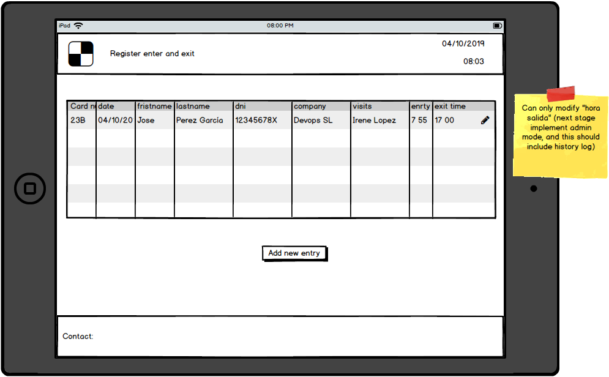
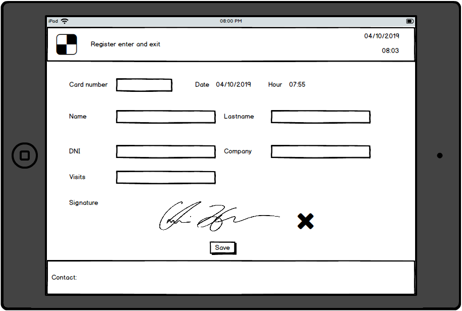
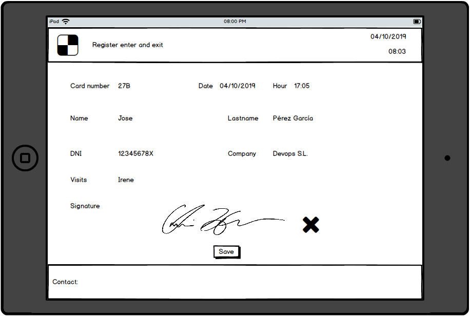

# Intro

In this excercise we will implement a simple entry / exit register application.

# Prerequisites

- Redux basics excercises must be completed first.
- Redux Sagas workshop must be completed first.

# Functional

Implement a daily entry/exit register application:

- Target will be table.
- It will display a list of entries.
- A given user can add a new entry.
- A given user can register his exit time.
- It should support pad signature.

# Cases to be assigned

List of cases to be assigned:

- [1] Create a simple backend (we will make use of JSON server).

  - [Depends on 1][1.2] Create an API entry that will provide today's list of entries.
  - [Depends on 1][1.3] Create an API entry that will read an specific entry data.
  - [Depends on 1][1.4] Create an API entry that will allow to insert a new entry.
  - [Depends on 1][1.5] Create an API entry that will allow to update an exit.

- [2] Create a reducer that will contain the list of todays entries

  - [Depends on 2+1.2][7] Create a saga that will read a list of users form API and store it
    in the reducer.
  - [Depends on 2+1.4][8] Create a saga to insert a new entry and updates the entry reducer
  - [Depens on 2+.1.4][9] Create a saga to update exit time on both api and reducer

- [3] Layout

  - Build the application layout (header / footer).

- [4] Pods UI Components

  - Build the list of entries UI (use viewmodel + mockdata).
  - Build the add new entry UI (use viewmodel + mockdata).
  - Build the update exit on existing entry (use viewmodel + mockdata).

- [5] Build the form validations

- [6] Implement containers (pending on 1,2).

- [7] Spike track signature pad

[Bonus]:

- Implement paging.
- Admin view
-
